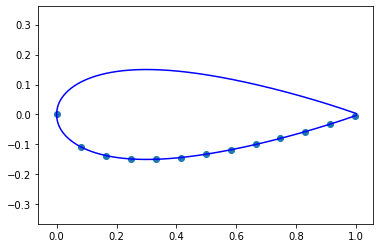
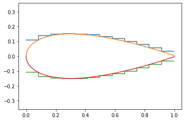

```python
import numpy as np
import matplotlib.pyplot as plt
import pandas as pd
```


```python
x = np.linspace(0,1, 1001)
```


```python
t = .3
```


```python
y = 5*t*(.2969*x**.5 - .126*x-.3516*x**2 + .2843*x**3 - .1015*x**4)
```


```python
foil = pd.DataFrame({'x':x,'y':y})
```


```python
number_of_dados = 12
```


```python
n = len(x)//number_of_dados
xx = x[::n]
yy = y[::n]
```


```python
fig, ax = plt.subplots()
ax.plot(x,y, color = 'blue')
ax.plot(x,-y, color = 'blue')
plt.scatter(xx,-yy)
ax.axis('equal')
```


    (-0.06064229390681003,
     1.05664229390681,
     -0.16924233832841218,
     0.1652472376188942)





```python
def max_thickness_over_range(row):
    f = foil[(row.left <= foil['x']) & (foil['x'] <= row.right)]
    return f['y'].max()
    
```


```python
dado_plan = pd.DataFrame({'left':xx[:-1], 'right':xx[1:]})
dado_plan['thickness'] = dado_plan.apply(max_thickness_over_range, axis = 1)
T = .1
dado_plan['depth_of_cut'] = T - dado_plan['thickness']
```


```python
dado_plan
```


<div>
<style scoped>
    .dataframe tbody tr th:only-of-type {
        vertical-align: middle;
    }

    .dataframe tbody tr th {
        vertical-align: top;
    }

    .dataframe thead th {
        text-align: right;
    }
</style>
<table border="1" class="dataframe">
  <thead>
    <tr style="text-align: right;">
      <th></th>
      <th>left</th>
      <th>right</th>
      <th>thickness</th>
      <th>depth_of_cut</th>
    </tr>
  </thead>
  <tbody>
    <tr>
      <th>0</th>
      <td>0.000</td>
      <td>0.083</td>
      <td>0.109220</td>
      <td>-0.009220</td>
    </tr>
    <tr>
      <th>1</th>
      <td>0.083</td>
      <td>0.166</td>
      <td>0.137377</td>
      <td>-0.037377</td>
    </tr>
    <tr>
      <th>2</th>
      <td>0.166</td>
      <td>0.249</td>
      <td>0.148467</td>
      <td>-0.048467</td>
    </tr>
    <tr>
      <th>3</th>
      <td>0.249</td>
      <td>0.332</td>
      <td>0.150043</td>
      <td>-0.050043</td>
    </tr>
    <tr>
      <th>4</th>
      <td>0.332</td>
      <td>0.415</td>
      <td>0.149484</td>
      <td>-0.049484</td>
    </tr>
    <tr>
      <th>5</th>
      <td>0.415</td>
      <td>0.498</td>
      <td>0.143594</td>
      <td>-0.043594</td>
    </tr>
    <tr>
      <th>6</th>
      <td>0.498</td>
      <td>0.581</td>
      <td>0.132665</td>
      <td>-0.032665</td>
    </tr>
    <tr>
      <th>7</th>
      <td>0.581</td>
      <td>0.664</td>
      <td>0.117910</td>
      <td>-0.017910</td>
    </tr>
    <tr>
      <th>8</th>
      <td>0.664</td>
      <td>0.747</td>
      <td>0.100124</td>
      <td>-0.000124</td>
    </tr>
    <tr>
      <th>9</th>
      <td>0.747</td>
      <td>0.830</td>
      <td>0.079787</td>
      <td>0.020213</td>
    </tr>
    <tr>
      <th>10</th>
      <td>0.830</td>
      <td>0.913</td>
      <td>0.057121</td>
      <td>0.042879</td>
    </tr>
    <tr>
      <th>11</th>
      <td>0.913</td>
      <td>0.996</td>
      <td>0.032115</td>
      <td>0.067885</td>
    </tr>
  </tbody>
</table>
</div>


```python
cut_x = dado_plan[['left','right']].values.flatten()
cut_y = dado_plan[['thickness','thickness']].values.flatten()
```


```python
fig, ax = plt.subplots()

ax.plot(cut_x, cut_y)
ax.plot(x,y)
ax.plot(cut_x, -cut_y)
ax.plot(x,-y)
ax.axis('equal')
```


    (-0.05, 1.05, -0.1650474825834183, 0.1650474825834183)





```python

```
